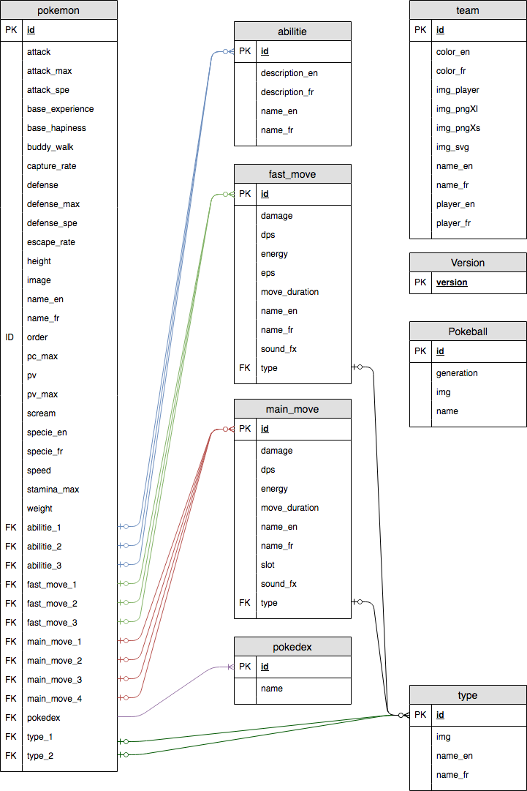

## POGOPI

Yet Another Pokemon Go Api.

Why ??
well, none is open sourced, and i need one for
the pokemon go javascript mini game.

So, I do my own ...

Most of informations comes from:
- https://pokemon.gameinfo.io
- https://pokeapi.co/
- https://db.pokemongohub.net/

but honestly, i haven't copy it all ^^

there's more than needed for the original project !

## Where to find images, sound and more ?

[ressource files](https://drive.google.com/open?id=1KDQCaqa3PZGC7zQHEeVUHQzciWeND1Hc)

## License

No Licence ... free use !

## Improve

Many informations aren't needed in my project.

But feel free to fork and contribute !

Missing some abilities, and more ...

## How to install

Download the project:

`git clone https://github.com/duduclx/pogopi.git`

or download as zip.

Add it at root of your project.

Edit the config file in:
 
 `api/Controller/config.php`
 
And `init.sql` to change the database name. 
 
Go to `http://your-server.com/install`
and click !

Or import `pogopi.sql` into your database !

## How to use

api is reponding in jsonContent.

go to `http://your-server.com/api/`
to see the swagger documentation.

following request are possible:

`api/abilitie`:
- list all abilities (talents)

`api/abilitie/{id or name}`:
- find abilitie (talent) by id or name

`api/fastmove`:
- list all fast move
 
`api/fastmove/{id or name}`:
- find a fast move by id or name

`api/generation` or `api/pokedex`:
- list all pokedex
 
`api/generation/{id or name}` or `api/pokedex/{id or name}`:
- find pokedex by id or name
 
`api/mainmove`:
- list all fast move
  
`api/mainmove/{id or name}`:
- find a fast move by id or name
 
`api/pokemon`:
- list all pokemons
  
`api/pokemon/id/{number}`:
- find pokemon by id
   
`api/pokemon/order/{number}`:
- find pokemon by order
 
`api/pokemon/type/{number}`:
- find all pokemons by type id
 
`api/pokemon/generation/{number}` or `api/pokemon/pokedex/{number}`:
- find all pokemons by pokedex id
 
`api/pokemon/fr/{name}` or `api/pokemon/en/{name}`:
- find pokemon by his name (not full name required)

`api/pokeball`:
- list all pokeballs
 
`api/pokeball/{id or name}`:
- find pokeball by id or name
 
`api/team`:
- list all teams
 
`api/team/{id or name or color}`:
- find team by id or name or color
 
`api/type`:
- list all types

`api/type/{id or name}`:
- find type by id or name

`api/version`:
- get the api's version
 
## database diagram

 
## examples of uses

Using api with js class:

[Pogojs mini game](https://github.com/duduclx/pogojs)

Using database with web php:

[Pogoweb](https://github.com/duduclx/pogoweb)

## TODO
 
 - league table and request (not really usefull)
 - player table and request (not pokemon go players)
 - audio clip table and request ? seriously ?