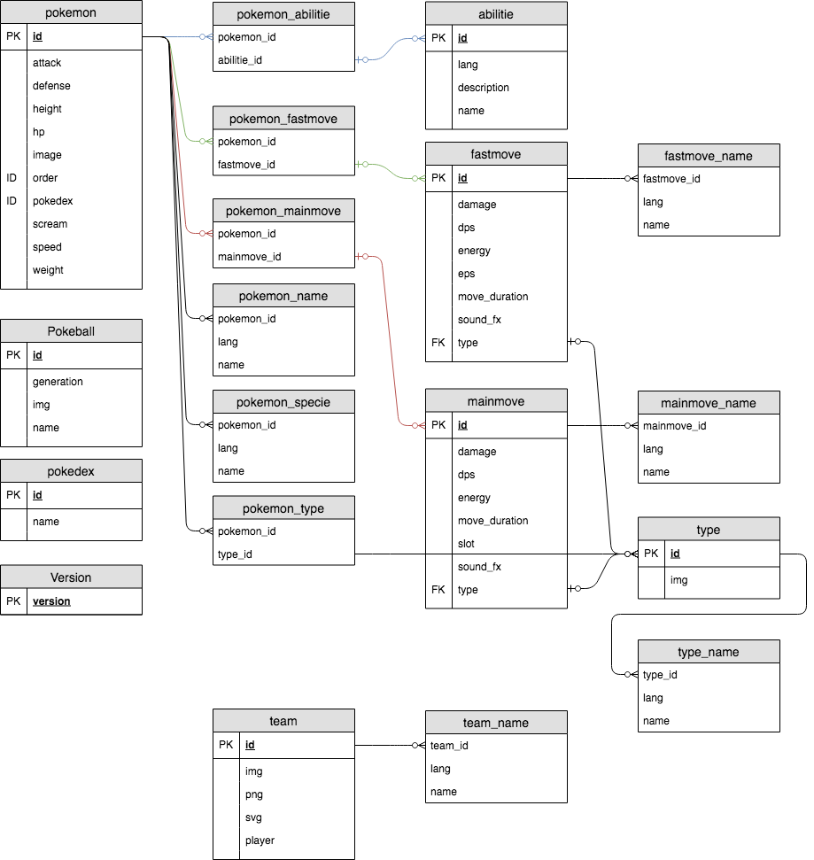

## POGOPI V2

Yet Another Pokemon Go Api.

Why ??
well, none is open sourced and/or allow cross-origin, and i need one for
the pokemon go javascript mini game.

So, I do my own ...

Most of informations comes from:
- https://pokemon.gameinfo.io
- https://pokeapi.co/
- https://db.pokemongohub.net/

but honestly, i haven't copy it all ^^

there's more than needed for the original project !

## Where to find images, sound and more ?

[resources](https://drive.google.com/open?id=1yUNuqhACrMinaOeew9dz4uegWW-sYgwg)

## License

No Licence ... free use !

## Improve

Many informations aren't needed in my project.

But feel free to fork and contribute !

Missing some abilities, and more ...

## How to install

Download the project:

`git clone https://github.com/duduclx/pogopi.git`

or download as zip.

Add it at root of your project.

Edit the config file in:
 
 `api/Controller/config.php`
 
And `init.sql` to change the database name. 
 
Go to `http://your-server.com/install`
and click !

Or import `pogopi.sql` into your database !

## How to use

api is reponding in jsonContent.

go to `http://your-server.com/api/`
to see the swagger documentation.

following request are possible:

abilitie:
 - api/abilitie/all
 - api/abilitie/id/{id}
 - api/abilitie/max
 - api/abilitie/name/{intl}/{name}

fastmove:
 - api/fastmove/all
 - api/fastmove/id/{id}
 - api/fastmove/max
 - api/fastmove/name/{intl}/{name}
 - api/fastmove/type/{id-name}

generation:
 - api/generation/all
 - api/generation/id/{id}
 - api/generation/max
 - api/generation/name/{name}
 
mainmove:
 - api/mainmove/all
 - api/mainmove/id/{id}
 - api/mainmove/max
 - api/manimove/name/{intl}/{name}
 - api/mainmove/type/{id-name}
 
pokeball:
 - api/pokeball/all
 - api/pokeball/id/{id}
 - api/pokeball/generation/{id}
 - api/pokeball/max
 - api/pokeball/name/{name}
 
pokemon:
 - api/pokemon/all
 - api/pokemon/max
 - api/pokemon/generation/{id}
 - api/pokemon/id/{id}
 - api/pokemon/name/{intl}/{name}
 - api/pokemon/order/{id}
 - api/pokemon/type/{id-name} 

team:
 - api/team/all
 - api/team/id/{id}
 - api/team/name/{intl}/{name}
 
type:
 - api/type/all
 - api/type/max
 - api/type/id/{id}
 - api/type/name/{intl}/{name}
 
version:
 - api/version
 
## database diagram

 
## examples of uses

Using api with js class:

[Pogojs mini game](https://github.com/duduclx/pogojs)

Using database with web php:

[Pogoweb](https://github.com/duduclx/pogoweb)

## TODO
 
 - add evolve chain
 - add pokemon's from gen 5 to 7
 - fix abilitie (missing some) or drop it
 - member/user and JWT api
